# Hair Edge Unisex Salon — Website

Premium, modern, mobile-first website for **Hair Edge Unisex Salon Madhapur**, Hyderabad.

The site is a fully responsive Next.js 14 application with a WhatsApp-based booking flow, live Google reviews, a 35-service catalog, blog, and local-SEO features.

---

## Screenshots

All screenshots were refreshed against the current build (`22 Sep 2026`) at **2× Retina quality**. Thumbnails link to the full-size images in [`demoImages/`](demoImages/). A combined [contact sheet](demoImages/_contact-sheet.html) is also available — open it locally to browse all shots in one grid.

### Desktop — 1440×900

| Home | Services |
|---|---|
| [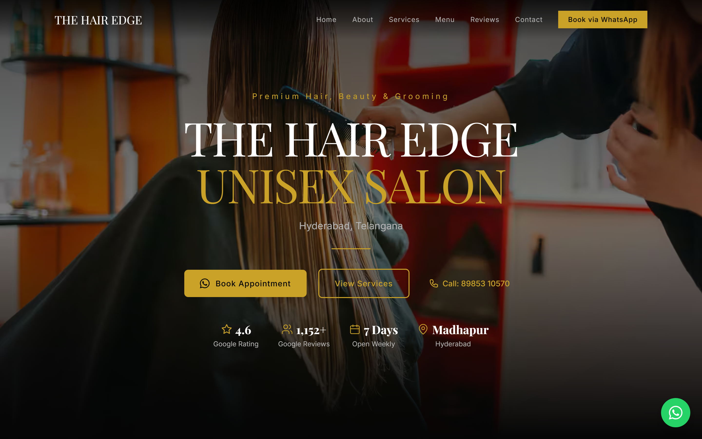](demoImages/01-desktop-home.png) | [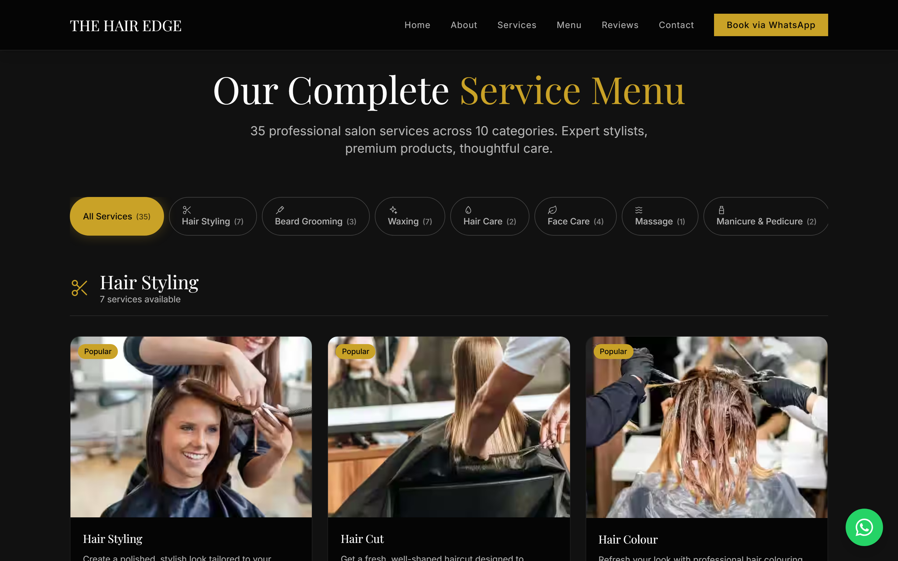](demoImages/02-desktop-services.png) |

| Gallery | Reviews |
|---|---|
| [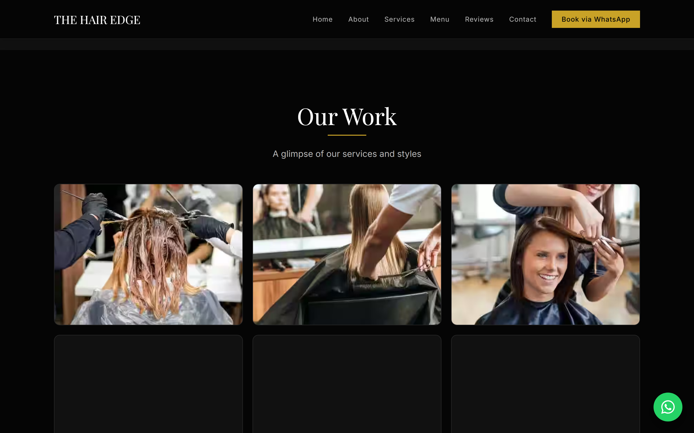](demoImages/03-desktop-gallery.png) | [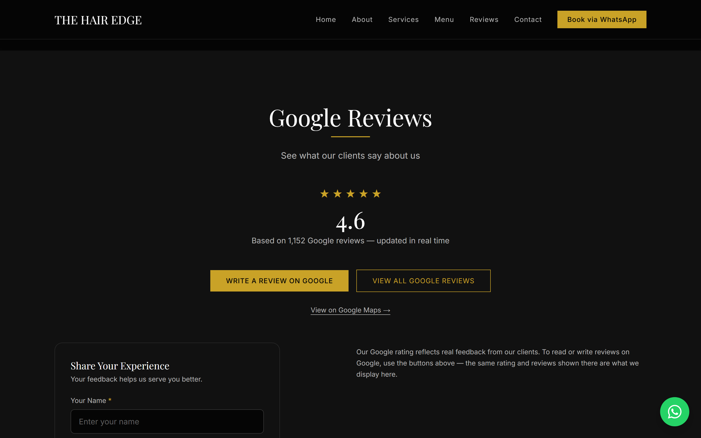](demoImages/04-desktop-reviews.png) |

| Service Detail | Booking Modal |
|---|---|
| [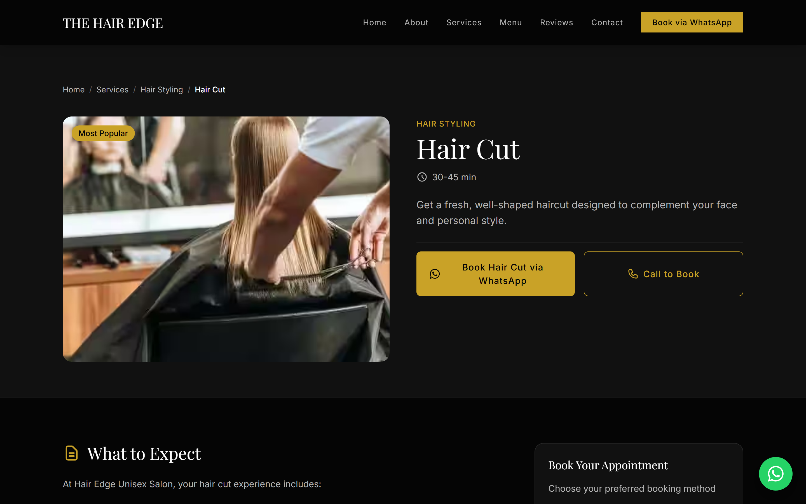](demoImages/05-desktop-service-detail.png) | [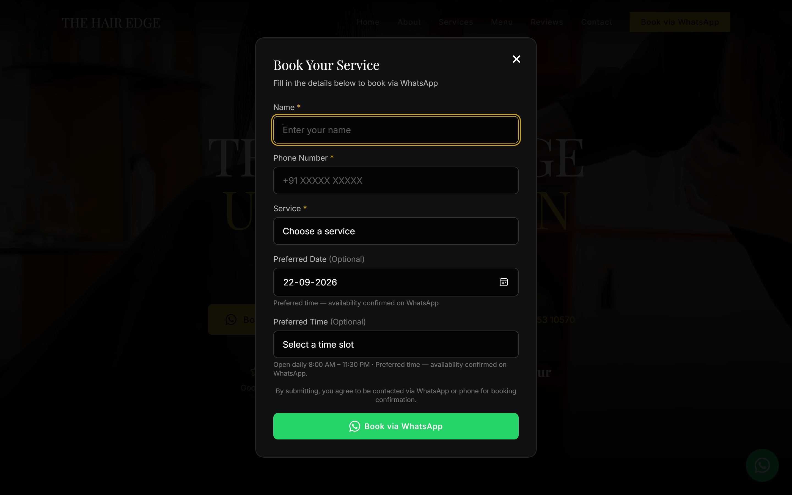](demoImages/06-desktop-booking-modal.png) |

| Blog |
|---|
| [](demoImages/07-desktop-blog.png) |

### Mobile portrait — 390×844

| Home | Services |
|---|---|
| [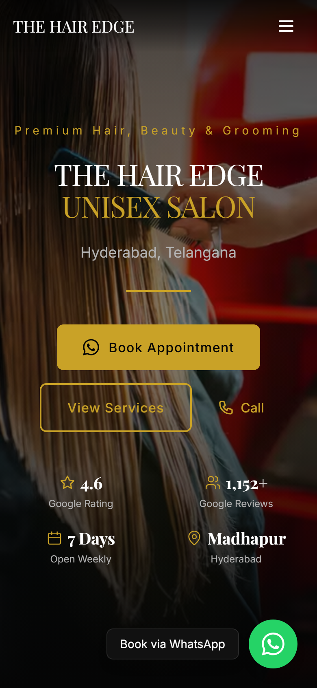](demoImages/08-mobile-portrait-home.png) | [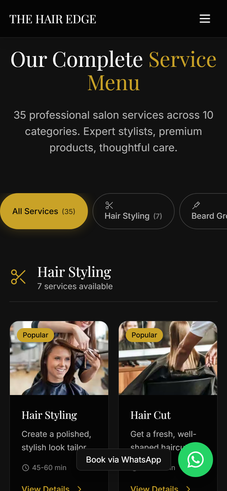](demoImages/09-mobile-portrait-services.png) |

| Service Detail | Booking Modal |
|---|---|
| [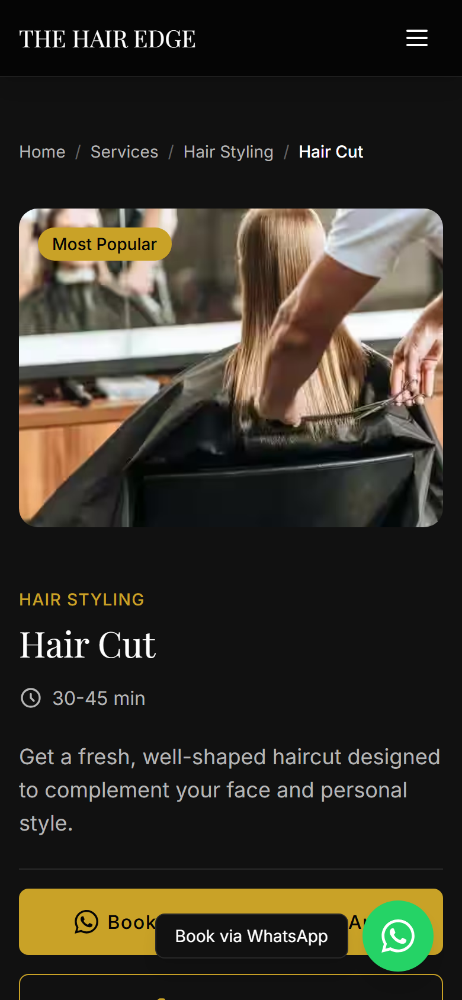](demoImages/10-mobile-portrait-service-detail.png) | [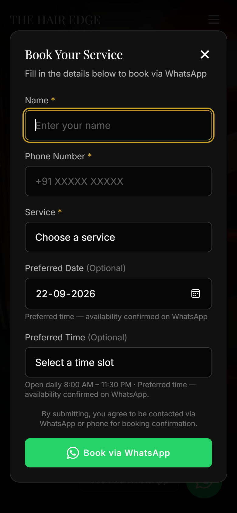](demoImages/11-mobile-portrait-booking-modal.png) |

| Reviews |
|---|
| [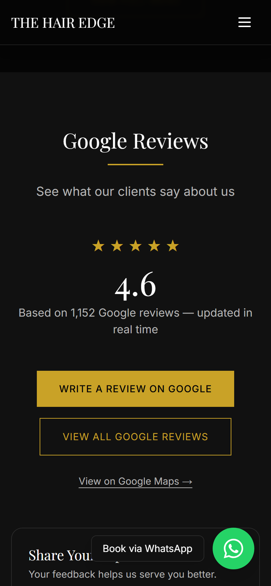](demoImages/12-mobile-portrait-reviews.png) |

### Mobile landscape — 844×390

| Home | Services |
|---|---|
| [](demoImages/13-mobile-landscape-home.png) | [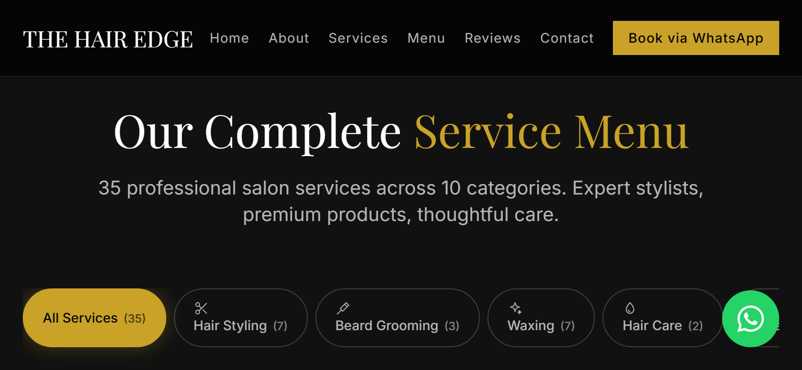](demoImages/14-mobile-landscape-services.png) |

| Service Detail |
|---|
| [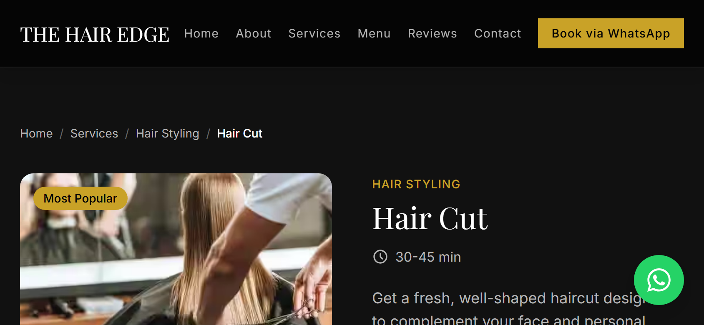](demoImages/15-mobile-landscape-service-detail.png) |

### Regenerating the screenshots

```bash
npm run dev                   # start the dev server (default :3000, or pass -p 3100)
npm run dev -- -p 3100        # recommended if port 3000 is already in use
# then, from a second terminal:
$env:DEMO_BASE_URL = "http://127.0.0.1:3100"   # only if using a non-default port
node scripts/capture-demo.mjs
```

The script drives headless Edge over CDP (zero dependencies) and rewrites all 15 screenshots into `demoImages/`.

---

## Features

- **Fully responsive** — desktop, tablet, mobile portrait & landscape layouts
- **WhatsApp booking** — modal-driven appointment form that opens a pre-filled `wa.me` chat, no data stored on the site
- **Live Google reviews** — server-fetched rating, review count and reviews via the Google **Places API (New)**
- **Complete service catalog** — 35 services across 9 categories with search, category filters and duration/price labels
- **Service detail pages** — breadcrumbs, pricing near the CTA, FAQs, related services
- **Blog** — 6 SEO articles with reading time, category tags and JSON-LD
- **Local SEO** — canonical URLs, breadcrumbs, `BeautySalon` + `FAQPage` + `BreadcrumbList` structured data, geo tags, sitemap, robots.txt
- **Open Graph / Twitter cards** — rich social sharing metadata
- **Security headers** — CSP, HSTS, `X-Frame-Options`, `Referrer-Policy`, `Permissions-Policy` (production)
- **Google Maps embed** — live map embed in the contact section
- **Analytics-ready** — GA4 optional via `NEXT_PUBLIC_GA_ID`

---

## Technology Stack

| Layer     | Technology                                |
|-----------|-------------------------------------------|
| Framework | Next.js 14 (App Router)                   |
| Language  | TypeScript                                |
| Styling   | Tailwind CSS                              |
| Fonts     | Google Fonts (Playfair Display + Inter)   |
| Maps      | Google Maps Embed API                     |
| Reviews   | Google Places API (New)                   |
| Booking   | WhatsApp Deep Link (`wa.me`)              |
| Images    | Next Image + AVIF/WebP (local fixtures)   |

---

## Getting Started

### 1. Install

```bash
cd hair-edge-salon
npm install
```

### 2. Environment variables

Create `.env.local` (copy from `.env.example`):

```env
# Google Places API (New) - Server-side only
GOOGLE_PLACES_API_KEY=your_places_api_key

# Google Maps Embed API - Browser-side
NEXT_PUBLIC_GOOGLE_MAPS_EMBED_API_KEY=your_maps_embed_api_key

# Google Place ID (already configured for Hair Edge Madhapur)
GOOGLE_PLACE_ID=ChIJVVVVKV6RyzsR82Zy8PIOmmA

# Optional
NEXT_PUBLIC_SITE_URL=https://hair-edge-unisex-salon.netlify.app
NEXT_PUBLIC_GA_ID=
```

`.env.local` and all secrets are git-ignored — never commit them.

### 3. Run in development

```bash
npm run dev
```

Open [http://localhost:3000](http://localhost:3000) (or the `-p` port you chose).

### 4. Production build & start

```bash
npm run build    # builds and regenerates sitemap.xml via postbuild
npm run start
```

### 5. Lint & typecheck

```bash
npm run lint
npm run typecheck
```

---

## Project Structure

```
hair-edge-salon/
├── app/
│   ├── api/
│   │   ├── google-place/          # Server fetch → Google Places API (New)
│   │   └── google-photo/[...path] # Google Places photo proxy (rate-limited)
│   ├── blog/                      # Blog index + [slug] detail pages
│   ├── services/                  # Services catalog + [id] detail pages
│   ├── privacy/ · terms/          # Legal pages
│   ├── layout.tsx                 # Root layout, metadata, JSON-LD
│   ├── page.tsx                   # Home: Hero, About, Services, Gallery,
│   │                              #   Brands, Menu, Reviews, Contact
│   ├── globals.css · manifest.ts · icon.png · apple-icon.png
├── components/
│   ├── layout/                    # Navbar, Footer, FloatingWhatsApp
│   ├── sections/                  # Hero, About, Services, Gallery, Team,
│   │                              #   Transformations, Brands, Menu, Reviews, Contact
│   ├── services/                  # ServicesCatalog, ServiceCard, CategoryFilter, BookingModal
│   └── ui/                        # Button, Modal, Icon, SectionHeading, ...
├── config/
│   └── salon.config.ts            # ★ Single source of truth for all business data
├── lib/
│   ├── blog-posts.ts              # Blog content
│   ├── jsonld.ts · utils.ts · analytics.ts · rate-limit.ts
├── scripts/
│   ├── capture-demo.mjs           # Regenerates all 15 screenshots (headless Edge CDP)
│   ├── generate-sitemap.mjs       # postbuild sitemap generator
│   └── generate-brand-assets.mjs
├── types/salon.ts                 # TypeScript types
├── public/images/                 # Static assets (avif/webp/svg)
└── demoImages/                    # Demo screenshots for this README
```

---

## Configuration

**All business data lives in one place:** `config/salon.config.ts` — name, contact numbers (public phone vs. WhatsApp booking line), full address + GPS, Google Place ID/CID, opening hours, booking time slots, services/categories, social links, brand colors, gallery images, SEO copy, and feature toggles.

Single source of truth keeps the visible site, booking slots and JSON-LD structured data in sync.

### Where to replace images

Place images under `public/images/`:

- `services/` — service photos (AVIF/WebP)
- `menu/` — physical menu photo
- `hero/` — hero background
- `logo/` — salon logo
- `brands/` — "Brands We Trust" SVG logos

Then update the relevant paths in `config/salon.config.ts` → `assets`.

---

## How the WhatsApp Booking Works

1. Customer clicks **Book Appointment** (hero, navbar, service cards, detail pages)
2. Modal opens with service preselected where relevant
3. Customer enters name + phone, chooses service, preferred date/time
4. Form validates input client-side
5. Generates a formatted WhatsApp message
6. Opens `wa.me/916304884778?text=...` in a new tab
7. Salon confirms availability and replies in WhatsApp

**No booking data is stored or sent anywhere except the customer's own WhatsApp.**

---

## How Google Reviews Work

1. Frontend calls `/api/google-place`
2. Server proxy fetches Google Places API (New)
3. Returns rating, review count and reviews
4. Frontend renders with Google attribution
5. "Write a review" links to the Google Business profile

Requires a valid `GOOGLE_PLACES_API_KEY`.

---

## Google Cloud Setup

1. **Create/select** a project at [Google Cloud Console](https://console.cloud.google.com)
2. **Enable** the **Places API (New)** and **Maps Embed API**
3. **Create two API keys** (Credentials → Create Credentials → API Key):
   - **Places key** (server-side) — restrict to Places API only
   - **Maps Embed key** (browser) — restrict to Maps Embed API + HTTP referrer (your domain)
4. **Restrict keys** as above before production use

---

## Deployment

### Vercel (recommended)

1. Push the repository to GitHub
2. Import the repo in Vercel (it auto-detects Next.js)
3. Add environment variables in the project settings (same as `.env.example`)
4. Deploy — Vercel builds with `npm run build` (postbuild regenerates `sitemap.xml`)

### Other Node.js platforms

```bash
npm run build
npm run start
```

Deploy the app bundle with a Node.js runtime. Environment variables as above.

---

## License

Private — Hair Edge Unisex Salon Madhapur.